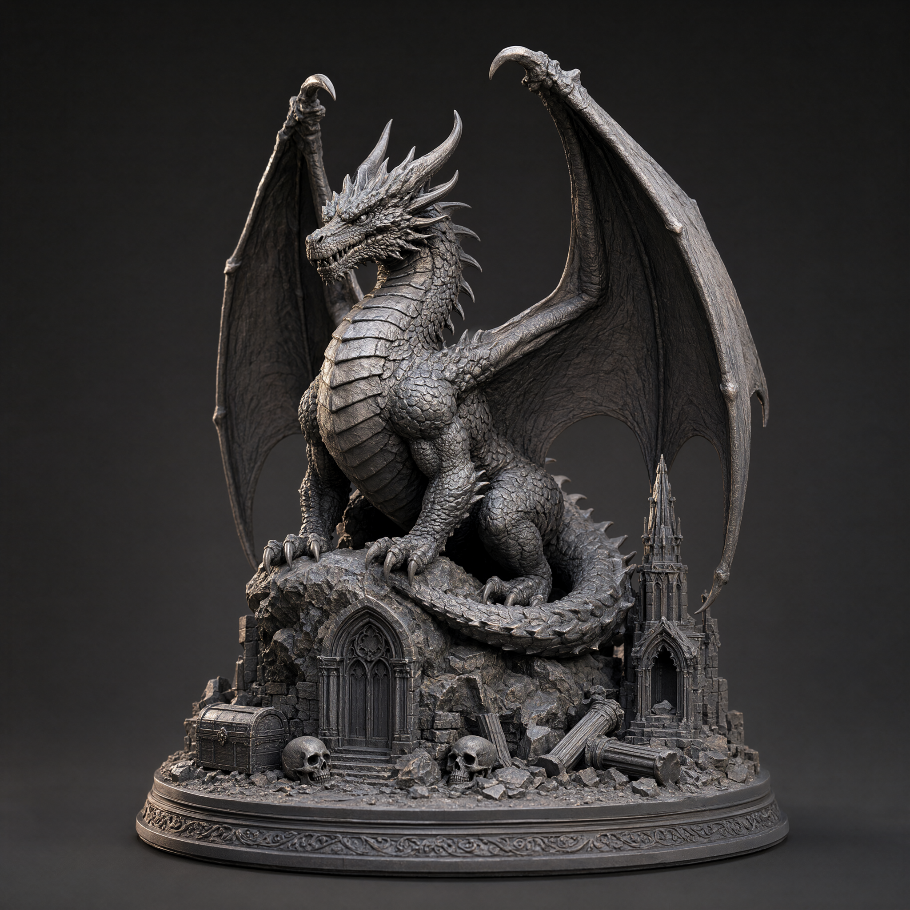

# PixelArtistry · Image to 3D Print

One image in, a **watertight, print-ready 3D model** out. Free and local in ComfyUI, using Pixal3D / TRELLIS.2 and a one-click installer for Windows.

▶ Video: [VIDEO LINK – TODO]

*The example image from the video, made with Qwen-Image 2.1 at 2048 × 2048.*

> [!IMPORTANT]
> **Before you start:** install **[ComfyUI Easy-Install](https://github.com/Tavris1/ComfyUI-Easy-Install)** and **TRELLIS.2** first, by following my **[TRELLIS.2 Installation Guide](https://go.pixel-artistry.com/Trellis2InstallationGuide)**. This installer builds on that setup and won't work without it.

## What you get

| File | For which GPU | What changes |
|---|---|---|
| `workflows/PixelArtistry_Print_00_Image_Qwen.json` | – | Optional first step: Qwen-Image 2.1 text-to-image, 2048 × 2048. Makes the front image |
| `workflows/PixelArtistry_Print_01_1K.json` | 6–8 GB | Smallest and fastest. Resamples to ~1K. About 300 MB STL |
| `workflows/PixelArtistry_Print_02_1536.json` | 8 GB+ | The default tier. About 400 MB STL |
| `workflows/PixelArtistry_Print_03_2K.json` | 16 GB+ | Maximum detail. About 500 MB STL |
| `workflows/PixelArtistry_Print_04_Multiview.json` | 12 GB+ (see Multiview) | Builds back and sides first, then the 1536 tier |

All five are free. The installer already contains 01–04. Workflow 00 is in `workflows/`: load it by hand, or drag `examples/dragon_front.png` into ComfyUI.

The three single-image workflows use the same models and the same seeds. The tier only changes how much detail survives.

## Requirements

- **A working ComfyUI + TRELLIS.2 setup – follow the [TRELLIS.2 Installation Guide](https://go.pixel-artistry.com/Trellis2InstallationGuide)**
- Windows 10 or 11, NVIDIA GPU (RTX 20 series or newer)
- **Latest ComfyUI.** Qwen-Image 2.1 and Pixal3D are core nodes
- [ComfyUI Easy-Install](https://github.com/Tavris1/ComfyUI-Easy-Install) with Python 3.12 and PyTorch 2.8.0 + CUDA 12.8
- [VisualBruno's ComfyUI-Trellis2](https://github.com/visualbruno/ComfyUI-Trellis2) installed. It provides CuMesh
- [Blender](https://www.blender.org/download/). LODTailor uses it
- RAM: **32 GB+ recommended**, especially for 2K

## Install

1. Download `install_win.bat`.
2. Put it into your `ComfyUI-Easy-Install\Add-ons` folder (the Easy-Install or portable root folder works too).
3. Close ComfyUI and double-click the file.
4. Answer the two questions about the optional models (see below).
5. When the summary shows only `[OK]` lines, start ComfyUI and open **Workflows → PixelArtistry**.
6. In each workflow, paste your Blender path once into the purple **Blender path** node and load your image in **Load Image**.

What the installer does:

1. Checks Python, PyTorch, CUDA and your GPU
2. Downloads the node packs – pinned to the exact versions tested for the video: WTiVo, LODTailor, Mesh Quad Reconstruct, Memory Cleaner, Fast Merge by Distance and CuMesh Decimate
3. Picks the right WTiVo build for your GPU (RTX 50 or RTX 20/30/40)
4. Installs the Python dependencies into `python_embeded`
5. Runs a quick watertight test on your GPU
6. Installs the four workflows and the dragon example image
7. Checks the models and downloads the missing ones from Hugging Face
8. Looks for Blender

The basic install always gives you the single-image → print path from the video. Two optional questions:

- **Image models (Y/N):** Qwen-Image 2.1 text-to-image. `qwen_image_2.1_int8_convrot`, `qwen3vl_8b_int8_convrot` and `qwen_image_2.1_vae_bf16`. Skip them if you bring your own image.
- **Multiview (Y/N):** `pixal3d_multiview_int8_convrot`. The view generation uses the same three Qwen-Image 2.1 files, so choosing multiview installs those too. Files you already have are skipped.

It's safe to run again: everything is set back to the tested versions.

## Step by step

### 1. Make the image

Load [`workflows/PixelArtistry_Print_00_Image_Qwen.json`](workflows/PixelArtistry_Print_00_Image_Qwen.json) (Qwen-Image 2.1 text-to-image, **2048 × 2048**) and use the prompt from [`prompts/printable_statue.md`](prompts/printable_statue.md).

Dragging `examples/dragon_front.png` into ComfyUI loads the exact setup.

Or use any image of your own: square, the full object visible, a plain background.

### 2. Pick your tier and run it

Load the 1K, 1536 or 2K workflow, load your image, set the Blender path and press **Run**.

Back looks wrong (an extra tail)? **Run again.** The structure seed randomizes. The same seed gives the same model in all three tiers.

### 3. Check in Blender

- Look for loose fragments. If `bodies` is greater than 1 in the console: Edit Mode → click the model → `Ctrl+L` → `Ctrl+I` → `X` → Vertices.
- Open the 3D Print Toolbox → **Check All**.
- Export an STL with **Selection Only**.

### 4. Slice and print

Short version: model standing flat, solid, supports on the 0.25 mm cone tips, no raft, warm vat. The full settings are in [`docs/PRINT_GUIDE.md`](docs/PRINT_GUIDE.md).

## Print tiers

| | 1K | 1536 | 2K |
|---|---|---|---|
| GPU guide | 6–8 GB | 8 GB+ | 16 GB+ |
| Upsample target_resolution | 1536 | 1536 | 2048 |
| WTiVo res / proxy points | 1024 / 12M | 1536 / 16M | 2048 / 25M |
| LODTailor relative_voxel_size / target_tris | 0.001 / 6M | 0.00065 / 8M | 0.0005 / 10M |
| STL size | ~300 MB | ~400 MB | ~500 MB |
| Smallest detail at 100 mm height | ~0.10 mm | ~0.065 mm | ~0.05 mm |

## Why these settings

**Quad Reconstruct is bypassed.** It flattens fine detail. Without it, the raw mesh going into WTiVo went from 13.2M to 29.2M faces, which means more surface detail on the print. WTiVo's `component_mode = largest` still drops floating fragments.

**LODTailor's voxel size changes per tier.** Voxel size = largest dimension × `relative_voxel_size`. At 0.001 that is about 1,000 voxels across the model, so everything gets resampled to ~1K. The rule is **1 / resolution**.

**Proxy points.** Check the console for `strong_features=A->B`. If B is smaller than A, raise the proxy points.

## Measured on my machine

RTX 5080 16 GB, 48 GB RAM.

| | |
|---|---|
| 1K run | 12:23 min |
| 1536 run | 18:18 min |
| 2K run | not measured yet |
| WTiVo peak VRAM | 3.7 GB |
| Dragon at 100 mm height | 1,998 layers, 3 h 57 min, 255 ml resin for two |

## Multiview (free)

**When to use it:** the back from a single image is wrong or invented (two tails, extra parts). You fix the back in 2D, where a reroll takes about a minute instead of a full 3D run.

**How it works:**

1. Qwen-Image 2.1 Edit makes the **back** from your front image.
2. It then makes **left** and **right** from front + back.
3. Pixal3D Multiview builds the shape from the four views.
4. The same watertight chain runs, at the 1536 tier by default.

**View rules** (full prompts in [`prompts/multiview_views.md`](prompts/multiview_views.md)):

- Back first. Left and right use front + back as references.
- Left: the front faces the left edge. Right: the front faces the right edge.
- A 180° orbit swaps left and right.
- Count what must not be duplicated ("exactly one tail").
- "Exact side profile, not a three-quarter view."
- Same backdrop as the front.

**Check the four views in Step 3 of the workflow before you trust the mesh:** right number of parts, parts on the correct side, true 90° profiles, nothing cropped. A bad view? Change only that view's seed and run again.

The Multiview models need about 12 GB VRAM in my earlier multiview tests. I haven't measured this print chain on smaller cards.

The PixelArtistry Trellis2+Pixal3D Workflow Pack covers multiview in depth in its PDF guide (more settings, troubleshooting): [Workflow Pack waitlist](https://go.pixel-artistry.com/Trellis2WorkflowPackWaitlist).

## Troubleshooting

- **Two tails or an invented back:** run again. The structure seed randomizes. Still wrong? Use the Multiview workflow.
- **The slicer says the model is ~1 mm:** it thinks the model is in inches. Answer **No**, then scale to your height.
- **The support raft merges with the base:** see the [print guide](docs/PRINT_GUIDE.md).
- **Holes after WTiVo:** set `lambda_fill` to 30–40.
- **Blender errors in the console (Auto-Rig Pro, PolyQuilt, …):** add-ons break headless Blender runs. Download the Blender zip, extract it, create an empty folder named `portable` next to `blender.exe`, and use that path in the Blender path node.
- **2K runs out of memory:** restart ComfyUI and close other programs before the run.
- **Installer says ComfyUI is still running:** close it and run the installer again.

## Credits

The watertight and low-poly steps run on free, open-source nodes by **MostAadTech** – please support him:
[YouTube](https://www.youtube.com/@MostAadTech) · [Patreon](https://www.patreon.com/cw/MostafaAwad/membership) · [GitHub](https://github.com/Mstafa-awad) · [X](https://x.com/MostAadTech)

| Node pack | Used for |
|---|---|
| [WTiVo](https://github.com/Mstafa-awad/WTiVo-WatertightVoxel-ComfyuiNode) | making the mesh watertight |
| [Mesh Quad Reconstruct](https://github.com/Mstafa-awad/ComfyUI-Mesh-Quad-Reconstruct) | the raw-mesh cleanup node (bypassed in these workflows) |
| [LODTailor Mesh Trimmer](https://github.com/Mstafa-awad/LODTailor-The-Mesh-Trimmer-ComfyuiNode) | lighter meshes that stay watertight |
| [WTiVo Fast Merge by Distance](https://github.com/Mstafa-awad/WTiVo-FastMergeByDistance) | welding duplicate vertices |
| [CuMesh Decimate](https://github.com/Mstafa-awad/ComfyUI-CuMesh-Decimate) | GPU decimation |
| [Memory Cleaner](https://github.com/Mstafa-awad/ComfyUI-Memory-Cleaner) | freeing VRAM between steps |

Also built on:
- [ComfyUI's official workflow templates](https://github.com/Comfy-Org/workflow_templates) for Pixal3D, TRELLIS.2, Qwen-Image 2.1 (text-to-image and Edit) (MIT, © Comfy Org)
- [VisualBruno's ComfyUI-Trellis2](https://github.com/visualbruno/ComfyUI-Trellis2) (CuMesh, O-Voxel)
- [TRELLIS.2](https://huggingface.co/microsoft/TRELLIS.2-4B) by Microsoft
- [Pixal3D](https://huggingface.co/TencentARC/Pixal3D) by Tencent ARC
- [Qwen-Image 2.1](https://huggingface.co/Qwen/Qwen-Image-2.1) by Qwen
- ComfyUI-ready model files from [Comfy-Org](https://huggingface.co/Comfy-Org)

## License

The installer and the workflows are MIT-licensed (see `LICENSE`). The workflows are based on ComfyUI's official templates (MIT, © Comfy Org).

The installer doesn't redistribute any node pack or model. It downloads them from their original sources, and each keeps its own license. The node packs are GPL-3.0 or MIT.

Model licenses, as shown on their Hugging Face model cards:

| Model | License |
|---|---|
| Qwen-Image 2.1 (`qwen_image_2.1_*`, `qwen3vl_8b_*`) | **Qwen Research License Agreement.** The weights are licensed for non-commercial use only. Commercial use of the weights needs a separate license from Qwen. See the [license](https://huggingface.co/Qwen/Qwen-Image-2.1/blob/main/LICENSE). Outputs are covered separately, see below |
| Pixal3D (`pixal3d_*`) | MIT ([TencentARC/Pixal3D](https://huggingface.co/TencentARC/Pixal3D)) |
| TRELLIS.2 (`trellis_2_*`) | MIT ([microsoft/TRELLIS.2-4B](https://huggingface.co/microsoft/TRELLIS.2-4B)) |
| MoGe 2 (`moge_2_vitl_normal_fp16`) | MIT ([Comfy-Org/MoGe](https://huggingface.co/Comfy-Org/MoGe)) |
| BiRefNet (`birefnet`) | MIT ([Comfy-Org/BiRefNet](https://huggingface.co/Comfy-Org/BiRefNet)) |
| DINOv3 encoder (`dino_v3_L_naf_fp32`) | Comfy-Org lists it in the MIT-tagged [Comfy-Org/Pixal3D](https://huggingface.co/Comfy-Org/Pixal3D). Pixal3D's NOTICE says third-party components keep their original licenses, so check the DINOv3 terms yourself |

Qwen-Image 2.1 is only needed for the optional image step and for Multiview. If you bring your own image and use the single-image workflows, those two aren't involved.

**Qwen outputs:** the license applies to the model weights, not to the images they generate. The official [@QwenDevs post on X](https://x.com/QwenDevs) (21 Sep 2026) says: "Outputs are not part of the licensed Materials. Users retain the rights to images and other content they generate using the model." That is a statement on X, not part of the license text. Whether running the weights in a commercial setting needs a Qwen license is a question for the license itself, so ask Qwen (the license lists a contact for commercial licenses) if you are unsure.

**Commercial use of prints depends on these licenses.** Check every model card before you sell prints.

## PixelArtistry

- Website: https://pixel-artistry.com
- YouTube: https://www.youtube.com/@PixelArtistry_
- X: https://x.com/philippsieben
- Newsletter FutureFrames: https://go.pixel-artistry.com/newsletter
